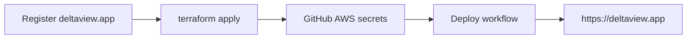

# DeltaView — AWS setup (deltaview.app, us-east-1)

Step-by-step for a **new AWS account** to get **https://deltaview.app** live.

Repo folder is still `LapViewer`; the product name is **DeltaView**.

---

## Overview



| Step | Time | Cost |
|------|------|------|
| 1. Secure AWS + IAM user | 15 min | $0 |
| 2. Register **deltaview.app** | 10 min | ~$14/year |
| 3. `terraform apply` | 15 min | ~$50–120/mo infra |
| 4. GitHub secrets + deploy | 10 min | $0 |
| 5. Test site | 5 min | $0 |

---

## Step 1 — AWS account basics

1. Sign in to [AWS Console](https://console.aws.amazon.com/)
2. **Root account:** enable MFA (IAM → Security credentials)
3. **Create IAM user** `deltaview-deploy`:
   - Access type: programmatic + console (optional)
   - Policy: `AdministratorAccess` for v1 (tighten later)
4. Create access key → save **Access key ID** and **Secret access key**

On your PC:

```powershell
aws configure
# AWS Access Key ID: ...
# AWS Secret Access Key: ...
# Default region: us-east-1
# Default output: json

aws sts get-caller-identity
```

Install [Terraform](https://developer.hashicorp.com/terraform/install) 1.5+.

---

## Step 2 — Register deltaview.app (before Terraform)

Terraform expects a **Route 53 hosted zone** for `deltaview.app`.

1. AWS Console → **Route 53** → **Register domains**
2. Search **`deltaview.app`**
3. Complete registration (contact info + payment)
4. Wait until status is **Registered** (often minutes; can take up to a day)

Route 53 creates a hosted zone automatically. Verify:

```powershell
aws route53 list-hosted-zones-by-name --dns-name deltaview.app
```

You should see a hosted zone for `deltaview.app`.

---

## Step 3 — Terraform (infrastructure + HTTPS)

```powershell
cd c:\Users\RecoveryAdmin\repos\LapViewer\infra\terraform

copy terraform.tfvars.example terraform.tfvars
# Edit if needed — defaults are deltaview.app + us-east-1

terraform init
terraform plan
terraform apply
```

Defaults in `terraform.tfvars.example`:

| Setting | Value |
|---------|--------|
| `project_name` | `deltaview` |
| `domain_name` | `deltaview.app` |
| `aws_region` | `us-east-1` |
| `enable_custom_domain` | `true` (ACM + HTTPS + Route 53 → ALB) |

**What Terraform creates:**

- VPC, ECS Fargate, ALB (HTTP→HTTPS redirect)
- ACM certificate for `deltaview.app` + `*.deltaview.app`
- Route 53 A records → ALB
- RDS Postgres, S3, ECR, Secrets Manager, CloudWatch

**Save outputs:**

```powershell
terraform output app_url
terraform output ecs_cluster_name
terraform output ecs_service_name
terraform output ecr_repository_url
```

Expected `app_url`: **`https://deltaview.app`**

### If domain is not registered yet

Copy `terraform.tfvars.example` to `terraform.tfvars` and set:

```hcl
enable_custom_domain = false
```

Apply once to get an HTTP ALB URL only. After the domain is registered, set `enable_custom_domain = true` and apply again.

---

## Step 4 — GitHub Actions (deploy)

Repo: https://github.com/n-pawlawski/LapViewer → **Settings → Secrets and variables → Actions**

### Secrets

| Name | Value |
|------|--------|
| `AWS_ACCESS_KEY_ID` | IAM user |
| `AWS_SECRET_ACCESS_KEY` | IAM user |

### Variables

| Name | Value |
|------|--------|
| `AWS_REGION` | `us-east-1` |
| `ECS_CLUSTER` | `deltaview` (or `terraform output ecs_cluster_name`) |
| `ECS_SERVICE` | `deltaview-api` (or `terraform output ecs_service_name`) |
| `ECR_REPOSITORY` | `deltaview` |
| `APP_URL` | `https://deltaview.app` |

---

## Step 5 — Deploy the app

GitHub → **Actions** → **Deploy** → **Run workflow** (branch `master`).

Or push to `master`.

The workflow builds Docker, pushes to ECR, and updates ECS. First deploy may take 5–10 minutes; DNS + ACM can take a few more minutes to propagate.

---

## Step 6 — Verify

```powershell
curl https://deltaview.app/api/ops/status
```

Expect JSON with `"ok": true`, `"deployEnv": "production"`, `"devUserMode": false`.

In the browser:

1. Open **https://deltaview.app**
2. **Register** a new account (no `root/root` in production)
3. **Intake** → upload a video file (S3 upload path)
4. Mark laps and play back

---

## Troubleshooting

| Issue | Check |
|-------|--------|
| `terraform apply` fails on hosted zone | Domain not registered yet — complete Step 2 |
| ACM validation stuck | Route 53 validation CNAME records (Terraform creates them) |
| 502 from ALB | ECS task not healthy — CloudWatch log group `/ecs/deltaview` |
| CORS / login fails | `CLIENT_ORIGIN` on ECS task = `https://deltaview.app` (set by Terraform) |
| Deploy workflow fails | GitHub secrets + ECR repo name `deltaview` |

See [agents/operations/RUNBOOK.md](../agents/operations/RUNBOOK.md).

---

## Tear down (stop charges)

```powershell
cd infra/terraform
terraform destroy
```

Also cancel or let expire domain registration separately in Route 53 if you no longer need it.

---

## Local dev (unchanged)

| Mode | URL |
|------|-----|
| Hot reload | http://localhost:5173 |
| Docker parity | http://deltaview.docker:3090 (see [DEVELOPMENT.md](../DEVELOPMENT.md)) |

Product code and npm package names may still say `lapviewer` internally; the public brand is **DeltaView**.
