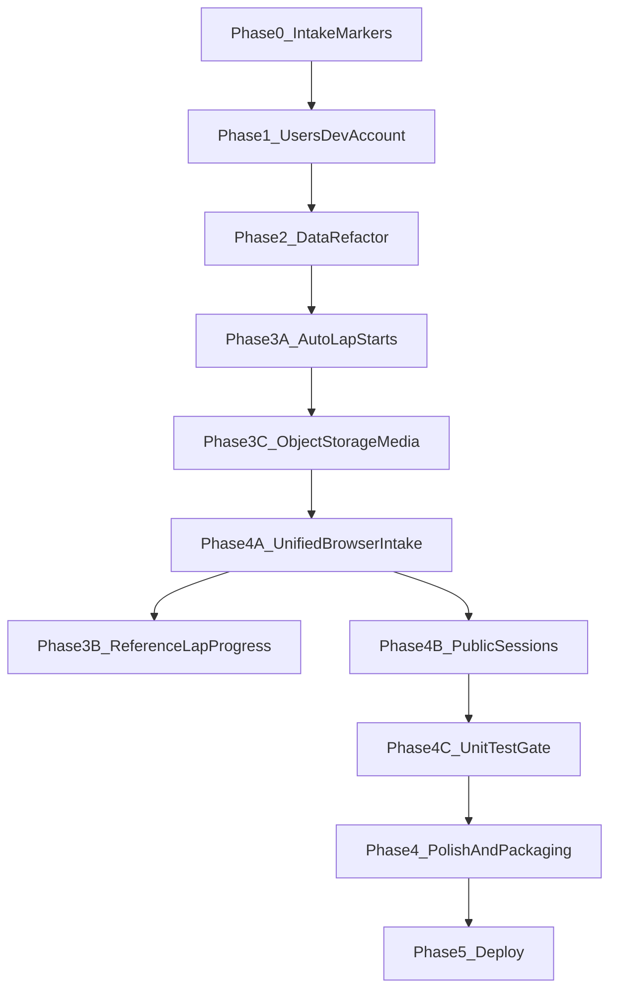

# Product Roadmap

Planning doc for LapViewer phases from local dev through cloud deploy.

**Status:** Active  
**Last updated:** 2026-07-07  
**Related:** [Project Overview](PROJECT_OVERVIEW.md), [Continuation](CONTINUATION.md), [Architecture](ARCHITECTURE.md)

---

## North star (long-term, not next)

LapViewer should eventually become a **web app where anyone can upload races and compare their laps with others**. That requires hosted deployment, **object storage for originals**, auth, and multi-tenant data rules.

Phase 1 Docker + MinIO can run locally without AWS spend. See [DEPLOYMENT.md](DEPLOYMENT.md).

---

## Guiding principles

1. **Finish the lap workflow first** — Compare is useless without Intake markers on real footage.
2. **Introduce users before the Data refactor** — Scope sessions to an owner now; refactor Data against a multi-tenant-ready model while still local.
3. **Dev account is a development tool, not a product feature** — Seeded only in local dev; never auto-created in production.
4. **Data refactor is product + engineering** — Layout polish, organization, unified lap browsing, and cleaner component structure together.
5. **One work stream at a time** — Avoid parallel big bets (accounts + Data rewrite + auto-lap detection simultaneously).

---

## Current baseline

| Area | State |
|------|-------|
| Data + Compare | Working — Data v2 toolbar, filters, all-laps tab, compare dock |
| [`DataPage.tsx`](../client/src/pages/DataPage.tsx) | Refactored — see [DATA_FORM_V2.md](features/DATA_FORM_V2.md) |
| [`sessions` table](../server/src/db/database.ts) | `userId` scoped; `isPublic` for sharing ([D-030](DECISIONS.md)) |
| Intake markers | Done |
| Auth / users | Done — dev account, Google OAuth, session scoping ([USERS_V1.md](features/USERS_V1.md), [D-029](DECISIONS.md)) |
| Intake model | **Done** — browser upload + object storage ([D-028](DECISIONS.md), [WO-unified-upload.md](work-orders/WO-unified-upload.md)) |
| Public sessions | **Done** — owner toggle, public browse, cross-account compare ([PUBLIC_SESSIONS_V1.md](features/PUBLIC_SESSIONS_V1.md), [D-030](DECISIONS.md)) |
| Permission guards | **In progress** — route redirects, API middleware, header nav visibility |
| Unit test gate (4C) | **Planned** — see [TESTING_STRATEGY.md](TESTING_STRATEGY.md) |
| Deploy | **In progress** — see [DEPLOYMENT.md](DEPLOYMENT.md), [WO-deploy-v1.md](work-orders/WO-deploy-v1.md) |

---

## Work order

| Phase | Focus | Spec |
|-------|-------|------|
| **0** | Intake lap marking | [INTAKE_FLOW.md](INTAKE_FLOW.md), [FEATURES.md](FEATURES.md) F2–F3 |
| **1** | Users & dev account | [features/USERS_V1.md](features/USERS_V1.md) |
| **2** | Data screen refactor | [features/DATA_FORM_V2.md](features/DATA_FORM_V2.md) — **Done** |
| **3** | Auto lap & split markers | [features/AUTO_LAP_DETECTION_V1.md](features/AUTO_LAP_DETECTION_V1.md), [features/GOPRO_LAP_SPLIT_DETECTION.md](features/GOPRO_LAP_SPLIT_DETECTION.md) |
| **4** | Polish, sharing & local packaging | [features/PUBLIC_SESSIONS_V1.md](features/PUBLIC_SESSIONS_V1.md), [ARCHITECTURE.md](ARCHITECTURE.md), [DEVELOPMENT.md](DEVELOPMENT.md) |
| **5** | Deploy (AWS SaaS) | [DEPLOYMENT.md](DEPLOYMENT.md), [WO-deploy-v1.md](work-orders/WO-deploy-v1.md) — **Active** |

Work orders (`WO-*`) are created when each phase moves to **Ready** per [FEATURE_LIFECYCLE.md](FEATURE_LIFECYCLE.md).

---

## Phase 0 — Intake lap marking

**Why first:** Without markers, Data and Compare have nothing meaningful on real sessions.

**Scope:**

- Marker API (`POST` / `PATCH` / `DELETE`)
- Intake timeline UI
- Auto-save on marker/metadata changes ([D-010](DECISIONS.md))

**Done when:** Register video → mark laps → see lap times on Data → compare two laps.

**Note:** Avoid hard-coding single-user assumptions in API handlers — leave room for a `userId` filter in Phase 1.

---

## Phase 1 — Users & accounts

Introduce a **user model** in the database and API, with a **dev account** for local work. Practices multi-tenancy without cloud auth.

### Dev account pattern

| Environment | Behavior |
|-------------|----------|
| **Local dev** (`NODE_ENV=development` or `LAPVIEWER_DEV_USER=1`) | Seed a fixed dev user on startup if missing; one-click **Continue as Dev** |
| **Production / hosted** | No dev seed; real signup/login only (built in Phase 4, before deploy) |
| **Local production test** (`npm start` without dev flag) | No dev seed — mirrors production on your machine |

**Suggested dev identity:** `dev@lapviewer.local`, display name **Dev Driver**, fixed UUID, **DEV ACCOUNT** badge in the header.

Full schema, API, and acceptance criteria: [features/USERS_V1.md](features/USERS_V1.md).

---

## Phase 2 — Data screen refactor

Turn Data from a working spike into the **command center** in [UI_DESIGN.md](UI_DESIGN.md) and [UI_FORMS.md](UI_FORMS.md).

### Sub-phases

| Sub-phase | Deliverable |
|-----------|-------------|
| **2A** | Split `DataPage` into `DataToolbar`, `SessionListPanel`, `SessionDetailPanel`, `useDataPageState` — no behavior change |
| **2B** | Toolbar (Add session, search, filter stubs), session cards, action row, compare tray layout |
| **2C** | Rename, edit metadata, delete session; sort sessions |
| **2D** *(optional)* | **All laps** tab — filterable cross-session lap table feeding the same Compare tray |

Full wireframes and AC: [features/DATA_FORM_V2.md](features/DATA_FORM_V2.md).

---

## Phase 3 — Auto lap & split markers

Build **after** Phase 2 so Intake and Data are stable. Three complementary sub-phases:

### 3A — Assisted lap starts (MVP, in progress)

Spike-validated ROI + template-bank detection on Intake. User seeds a start anchor; system proposes remaining lap-start markers for review.

- Spec: [features/AUTO_LAP_DETECTION_V1.md](features/AUTO_LAP_DETECTION_V1.md) — AD-1..AD-4 delivered; AD-5 splits next
- Work order: [work-orders/WO-auto-lap-detection.md](work-orders/WO-auto-lap-detection.md)

**Done when:** User can auto-detect lap starts on a calibrated track, review proposals, and confirm markers into the template bank.

### 3C — Object-storage media pipeline (done)

ffmpeg lap/split detection and reference builds work when session originals live in S3/MinIO, not only on local disk paths.

- Work order: [work-orders/WO-unified-upload.md](work-orders/WO-unified-upload.md) WO-U1
- Resolver: `resolveSessionMediaInput()` materializes S3 objects to `DATA_DIR/cache/{sessionId}/original.mp4` for ffmpeg

**Done when:** Auto-detect laps works on a browser-uploaded session in Docker (MinIO) and production (S3). **Met.**

### 3B — Reference-lap track progress (long-term)

Semi-automatic lap **and split** timing via a reusable **track profile**: one reference lap defines normalized track progress (`0.0 → 1.0`); new videos are matched to that map; laps = progress wraparound; splits = progress crossings.

- Design: [features/GOPRO_LAP_SPLIT_DETECTION.md](features/GOPRO_LAP_SPLIT_DETECTION.md) — LapViewer milestones **M2-LV–M7-LV**; integration design complete
- Spike gate: [work-orders/WO-gopro-progress-spike.md](work-orders/WO-gopro-progress-spike.md) — **passed GO** on `GX010012` (2026-07-06); M2-LV may proceed
- Decisions: D-019–D-024 in [DECISIONS.md](DECISIONS.md)

**Relationship:** 3A delivers immediate value on Intake with the existing marker model. 3C unblocks containers. 3B assumes object storage from the start. **Default sequencing:** finish 3A review → 3C → 4A → 3B.

---

## Phase 4 — Polish & local packaging

Before any deploy:

- Real login UI (non-dev) for `npm start` testing
- Export lap data (JSON/CSV) — see [OPEN_QUESTIONS.md §7.1](OPEN_QUESTIONS.md)
- `npm run build && npm start` polish
- **Docker Compose as primary parity path** — MinIO + browser upload ([ARCHITECTURE.md](ARCHITECTURE.md) Mode C)

### 4A — Unified browser intake (done)

One Intake UX everywhere: browser file picker → presigned PUT → object storage.

- Decision: [D-028](DECISIONS.md)
- Work order: [work-orders/WO-unified-upload.md](work-orders/WO-unified-upload.md) WO-U2..U3

**Done when:** Same upload flow in `npm run dev`, `docker compose up`, and ECS. **Met.**

### 4B — Public sessions (done)

Authenticated users can make uploaded (S3) sessions public; other accounts browse laps, stream video, and compare. Ignored intake laps are excluded from shared payloads.

- Spec: [features/PUBLIC_SESSIONS_V1.md](features/PUBLIC_SESSIONS_V1.md)
- Decision: [D-030](DECISIONS.md)
- Work order: [work-orders/WO-public-sessions.md](work-orders/WO-public-sessions.md)

**Done when:** Owner toggles public → another account sees session in Public tab and can compare. **Met.**

---

## Phase 5 — Deploy (active)

S3 presigned upload and ECS scaffold are implemented ([WO-deploy-v1.md](work-orders/WO-deploy-v1.md)). Remaining:

- First `terraform apply` + ECR push + production smoke
- Hosted deploy verified with Google OAuth (no dev seed)

**Partially delivered:** object-storage intake (3C/4A), Google OAuth (D-029), public session sharing (4B / D-030).

Future topics: Cognito (optional), leagues, anonymous share links.

---

## Phase 4C — Unit test gate

**Why:** Permission redirects, public session isolation, and split-detection eligibility are easy to break without automated coverage. This phase defines what must pass before promoting `dev` → `master`.

**Scope:**

- Document verification ladder in [TESTING_STRATEGY.md](TESTING_STRATEGY.md)
- Expand server tests for `requireUserPermission` on tracks, sessions, stats routes
- Add client tests for `hasPermission` / route guard helpers
- Wire CI (`npm run check` + `npm test`) when GitHub remote is configured

**Done when:** `npm test` fails on missing `tracks.manage` / `sessions.delete` / `stats.view`; roadmap and PROCESS_HYGIENE reference TESTING_STRATEGY as the promotion gate.

## Open choices

Decide before implementation of each phase:

| # | Question | Default recommendation |
|---|----------|------------------------|
| 1 | Dev login: auto-login vs **Continue as Dev** button? | **Button** |
| 2 | Tracks / detection profiles: per-user or global? | **Per-user** |
| 3 | **All laps** tab in Phase 2 or defer? | **Defer to 2D** after 2A–2C |
| 4 | Phase 0 before Phase 1? | **Yes** |

---

## Explicitly not in scope now

- Leagues / org-style sharing beyond session-level public toggle
- Anonymous or unauthenticated public URLs
- GoPro multi-file segment grouping (deferred)

---

## Traceability

| Doc | Role |
|-----|------|
| This file | Phase order and scope boundaries |
| [features/USERS_V1.md](features/USERS_V1.md) | Phase 1 detail |
| [features/PUBLIC_SESSIONS_V1.md](features/PUBLIC_SESSIONS_V1.md) | Phase 4B — public session sharing |
| [features/DATA_FORM_V2.md](features/DATA_FORM_V2.md) | Phase 2 detail |
| [features/AUTO_LAP_DETECTION_V1.md](features/AUTO_LAP_DETECTION_V1.md) | Phase 3A — assisted lap starts |
| [features/GOPRO_LAP_SPLIT_DETECTION.md](features/GOPRO_LAP_SPLIT_DETECTION.md) | Phase 3B — reference-lap progress (F8); spike WO |
| [work-orders/WO-unified-upload.md](work-orders/WO-unified-upload.md) | Phase 3C + 4A — object storage intake |
| [work-orders/WO-public-sessions.md](work-orders/WO-public-sessions.md) | Phase 4B — public sessions |
| [TESTING_STRATEGY.md](TESTING_STRATEGY.md) | Phase 4C — verification ladder and test expansion |
| [work-orders/WO-unit-test-gate.md](work-orders/WO-unit-test-gate.md) | Phase 4C — typed work items for parallel agents |
| [agents/archive/MULTIAGENT_DISPATCH_4C.md](agents/archive/MULTIAGENT_DISPATCH_4C.md) | Coordinator prompts and wave schedule (archived — not default workflow) |
| [DECISIONS.md](DECISIONS.md) | Accepted choices |
| [CONTINUATION.md](CONTINUATION.md) | Current implementation status |
