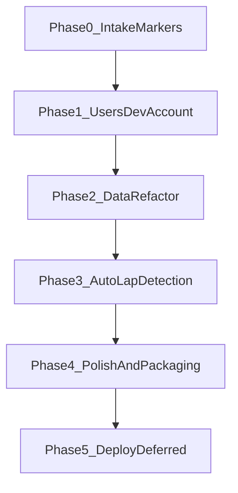

# Product Roadmap

Rough planning doc for LapViewer work **before any cloud deployment**.

**Status:** Active  
**Last updated:** 2026-07-06  
**Related:** [Project Overview](PROJECT_OVERVIEW.md), [Continuation](CONTINUATION.md), [Architecture](ARCHITECTURE.md)

---

## North star (long-term, not next)

LapViewer should eventually become a **web app where anyone can upload races and compare their laps with others**. That requires hosted deployment, object storage, auth, and multi-tenant data rules.

**Nothing in the phases below deploys to AWS.** See [Technical Approach — Deployment options](TECHNICAL_APPROACH.md#deployment-options) for the future hosting direction.

---

## Guiding principles

1. **Finish the lap workflow first** — Compare is useless without Intake markers on real footage.
2. **Introduce users before the Data refactor** — Scope sessions to an owner now; refactor Data against a multi-tenant-ready model while still local.
3. **Dev account is a development tool, not a product feature** — Seeded only in local dev; never auto-created in production.
4. **Data refactor is product + engineering** — Layout polish, organization, unified lap browsing, and cleaner component structure together.
5. **One work stream at a time** — Avoid parallel big bets (accounts + Data rewrite + auto-lap detection simultaneously).

---

## Current baseline

| Area | State |
|------|-------|
| Data + Compare | Working with SQLite; Data v2 toolbar, filters, all-laps tab, compare dock |
| [`DataPage.tsx`](../client/src/pages/DataPage.tsx) | Refactored — see [DATA_FORM_V2.md](features/DATA_FORM_V2.md) |
| [`sessions` table](../server/src/db/database.ts) | `userId` scoped; DELETE + flat laps API |
| Intake markers | Done |
| Auth / users | Done — dev account + session scoping ([USERS_V1.md](features/USERS_V1.md)) |
| Deploy | **Deferred** |

---

## Work order

| Phase | Focus | Spec |
|-------|-------|------|
| **0** | Intake lap marking | [INTAKE_FLOW.md](INTAKE_FLOW.md), [FEATURES.md](FEATURES.md) F2–F3 |
| **1** | Users & dev account | [features/USERS_V1.md](features/USERS_V1.md) |
| **2** | Data screen refactor | [features/DATA_FORM_V2.md](features/DATA_FORM_V2.md) — **Done** |
| **3** | Auto lap & split markers | [features/AUTO_LAP_DETECTION_V1.md](features/AUTO_LAP_DETECTION_V1.md), [features/GOPRO_LAP_SPLIT_DETECTION.md](features/GOPRO_LAP_SPLIT_DETECTION.md) |
| **4** | Polish & local packaging | [ARCHITECTURE.md](ARCHITECTURE.md), [DEVELOPMENT.md](DEVELOPMENT.md) |
| **5** | Deploy (deferred) | Revisit when Phases 0–4 are solid |

Work orders (`WO-*`) are created when each phase moves to **Ready** per [FEATURE_LIFECYCLE.md](FEATURE_LIFECYCLE.md).

---

## Phase 0 — Intake lap marking

**Why first:** Without markers, Data and Compare have nothing meaningful on real sessions.

**Scope:**

- Marker API (`POST` / `PATCH` / `DELETE`)
- Intake timeline UI
- Auto-save on marker/metadata changes ([D-010](DECISIONS.md))

**Done when:** Register video → mark laps → see lap times on Data → compare two laps.

**Note:** Avoid hard-coding single-user assumptions in API handlers — leave room for a `userId` filter in Phase 1.

---

## Phase 1 — Users & accounts

Introduce a **user model** in the database and API, with a **dev account** for local work. Practices multi-tenancy without cloud auth.

### Dev account pattern

| Environment | Behavior |
|-------------|----------|
| **Local dev** (`NODE_ENV=development` or `LAPVIEWER_DEV_USER=1`) | Seed a fixed dev user on startup if missing; one-click **Continue as Dev** |
| **Production / hosted** | No dev seed; real signup/login only (built in Phase 4, before deploy) |
| **Local production test** (`npm start` without dev flag) | No dev seed — mirrors production on your machine |

**Suggested dev identity:** `dev@lapviewer.local`, display name **Dev Driver**, fixed UUID, **DEV ACCOUNT** badge in the header.

Full schema, API, and acceptance criteria: [features/USERS_V1.md](features/USERS_V1.md).

---

## Phase 2 — Data screen refactor

Turn Data from a working spike into the **command center** in [UI_DESIGN.md](UI_DESIGN.md) and [UI_FORMS.md](UI_FORMS.md).

### Sub-phases

| Sub-phase | Deliverable |
|-----------|-------------|
| **2A** | Split `DataPage` into `DataToolbar`, `SessionListPanel`, `SessionDetailPanel`, `useDataPageState` — no behavior change |
| **2B** | Toolbar (Add session, search, filter stubs), session cards, action row, compare tray layout |
| **2C** | Rename, edit metadata, delete session; sort sessions |
| **2D** *(optional)* | **All laps** tab — filterable cross-session lap table feeding the same Compare tray |

Full wireframes and AC: [features/DATA_FORM_V2.md](features/DATA_FORM_V2.md).

---

## Phase 3 — Auto lap & split markers

Build **after** Phase 2 so Intake and Data are stable. Two complementary specs:

### 3A — Assisted lap starts (MVP, in progress)

Spike-validated ROI + template-bank detection on Intake. User seeds a start anchor; system proposes remaining lap-start markers for review.

- Spec: [features/AUTO_LAP_DETECTION_V1.md](features/AUTO_LAP_DETECTION_V1.md) — AD-1..AD-4 delivered; AD-5 splits next
- Work order: [work-orders/WO-auto-lap-detection.md](work-orders/WO-auto-lap-detection.md)

**Done when:** User can auto-detect lap starts on a calibrated track, review proposals, and confirm markers into the template bank.

### 3B — Reference-lap track progress (long-term)

Semi-automatic lap **and split** timing via a reusable **track profile**: one reference lap defines normalized track progress (`0.0 → 1.0`); new videos are matched to that map; laps = progress wraparound; splits = progress crossings.

- Design: [features/GOPRO_LAP_SPLIT_DETECTION.md](features/GOPRO_LAP_SPLIT_DETECTION.md)
- Milestones M1–M7 in that doc (import → track profile → visual matching → sequence alignment → lap/split detection → comparison → correction)

**Relationship:** 3A delivers immediate value on Intake with the existing marker model. 3B is the architecture for accurate split deltas and cross-session comparison when a reference lap exists. Converge after AD-5 (split keyframes) or when reference-lap matching is ready to replace/augment ROI-only detection.

---

## Phase 4 — Polish & local packaging

Before any deploy:

- Real login UI (non-dev) for `npm start` testing
- Export lap data (JSON/CSV) — see [OPEN_QUESTIONS.md §7.1](OPEN_QUESTIONS.md)
- `npm run build && npm start` polish
- Optional Docker Compose ([ARCHITECTURE.md](ARCHITECTURE.md) Mode C)

---

## Phase 5 — Deploy (deferred)

Reopen hosting work only after:

- Intake + Compare proven on real footage
- User model + session scoping in place
- Data form refactor shipped
- Real auth tested locally without dev seed

Future topics: AWS, S3 uploads, Cognito, cross-user compare, leagues. Not scheduled.

---

## Open choices

Decide before implementation of each phase:

| # | Question | Default recommendation |
|---|----------|------------------------|
| 1 | Dev login: auto-login vs **Continue as Dev** button? | **Button** |
| 2 | Tracks / detection profiles: per-user or global? | **Per-user** |
| 3 | **All laps** tab in Phase 2 or defer? | **Defer to 2D** after 2A–2C |
| 4 | Phase 0 before Phase 1? | **Yes** |

---

## Explicitly not in scope now

- AWS / EC2 / S3 / Cognito
- Video upload pipeline
- Cross-user compare / leagues
- Production signup (designed in Phase 4, not before)

---

## Traceability

| Doc | Role |
|-----|------|
| This file | Phase order and scope boundaries |
| [features/USERS_V1.md](features/USERS_V1.md) | Phase 1 detail |
| [features/DATA_FORM_V2.md](features/DATA_FORM_V2.md) | Phase 2 detail |
| [features/AUTO_LAP_DETECTION_V1.md](features/AUTO_LAP_DETECTION_V1.md) | Phase 3A — assisted lap starts |
| [features/GOPRO_LAP_SPLIT_DETECTION.md](features/GOPRO_LAP_SPLIT_DETECTION.md) | Phase 3B — reference-lap progress, splits, comparison |
| [DECISIONS.md](DECISIONS.md) | Accepted choices (add D-0XX for dev account when Phase 1 starts) |
| [CONTINUATION.md](CONTINUATION.md) | Current implementation status |
