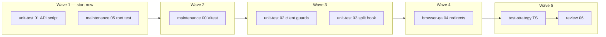

# Multi-agent dispatch — Phase 4C (WO-unit-test-gate)

> **Archived (2026-07-08).** Parallel multi-agent wave scheduling is **not** the default
> LapViewer workflow (solo maintainer + AI). This doc is kept for reference only. See the
> **Process tiers** section in `docs/agents/BASE_AGENT.md` for the current approach.

**Purpose:** Run multiple agents in parallel on `WO-unit-test-gate` without stepping on each other.  
**Work order:** [../../work-orders/WO-unit-test-gate.md](../../work-orders/WO-unit-test-gate.md)  
**Branch:** `feature/unit-test-gate` (all agents share this branch; merge conflicts resolved by coordinator)

---

## Before you start

1. Branch from `dev`:

   ```bash
   git checkout dev
   git pull   # when remote exists
   git checkout -b feature/unit-test-gate
   ```

2. Ensure baseline passes:

   ```bash
   npm run check
   npm test
   ```

3. Only pick up items with **Status: Ready** and no unresolved **Blocked by**.

---

## Parallel waves



| Wave | Parallel agents | Item IDs | Typical duration |
|------|-----------------|----------|------------------|
| 1 | 2 | 01 + 05 | Independent files |
| 2 | 1 | 00 | Touches `client/package.json` |
| 3 | 2 | 02 + 03 | Different test files under `client/` |
| 4 | 1 | 04 | Manual browser |
| 5 | 1 then 1 | TS → 06 | Docs + sign-off |

**Coordinator actions between waves:**

- After **01** and **05** are `Done`: set **00** → `Ready`
- After **00** is `Done`: set **02** and **03** → `Ready`
- After **02** is `Done`: set **04** → `Ready`
- After **01, 02, 03, 05** are `Done`: set **TS** → `Ready`
- After **TS** and **04** are `Done`: set **06** → `Ready`

---

## File ownership (avoid merge conflicts)

| Agent / item | Owns (exclusive) | Do not edit |
|--------------|------------------|-------------|
| 01 API script | `server/scripts/permissions-test.mjs`, `server/package.json` scripts | `client/` |
| 05 root test | Root `package.json` `test` script | Vitest config |
| 00 Vitest | `client/vitest.config.ts`, `client/package.json` devDeps | Server scripts |
| 02 client guards | `client/src/lib/permissions.test.ts`, `client/src/components/RequirePermission.test.tsx` | Hook tests |
| 03 split hook | `client/src/hooks/useSplitDetectionWorkflow.test.ts` | Permission tests |

If two agents must touch root `package.json`, **serialize**: 05 first (script chain), then 00 (add client test to chain).

---

## Copy-paste dispatch prompts

### Wave 1 — Unit Test Agent (item 01)

```text
Act as the LapViewer Unit Test Agent.
Read docs/agents/BASE_AGENT.md, docs/agents/unit-test/BASE.md, docs/agents/PICKUP.md.
Read docs/work-orders/WO-unit-test-gate.md and docs/agents/unit-test/context/permission-api-middleware.md.
Checkout branch feature/unit-test-gate.
Process work item WO-unit-test-gate-01 only.
Report per PICKUP.md §4.
```

### Wave 1 — Maintenance Agent (item 05)

```text
Act as the LapViewer Maintenance Agent.
Read docs/agents/BASE_AGENT.md, docs/agents/maintenance/BASE.md, docs/agents/PICKUP.md.
Read docs/work-orders/WO-unit-test-gate.md and docs/agents/maintenance/context/root-test-scripts.md.
Checkout branch feature/unit-test-gate.
Process work item WO-unit-test-gate-05 only.
Report per PICKUP.md §4.
```

### Wave 2 — Maintenance Agent (item 00)

```text
Act as the LapViewer Maintenance Agent.
Read docs/agents/BASE_AGENT.md, docs/agents/maintenance/BASE.md, docs/agents/PICKUP.md.
Read docs/work-orders/WO-unit-test-gate.md and docs/agents/maintenance/context/client-vitest-setup.md.
Checkout branch feature/unit-test-gate.
Process work item WO-unit-test-gate-00 only.
Report per PICKUP.md §4.
```

### Wave 3 — Unit Test Agent (items 02 + 03 in parallel sessions)

**Session A — permissions:**

```text
Act as the LapViewer Unit Test Agent.
Read docs/agents/BASE_AGENT.md, docs/agents/unit-test/BASE.md, docs/agents/PICKUP.md.
Read docs/work-orders/WO-unit-test-gate.md and docs/agents/unit-test/context/permission-client-guards.md.
Checkout branch feature/unit-test-gate.
Process work item WO-unit-test-gate-02 only.
Report per PICKUP.md §4.
```

**Session B — split workflow:**

```text
Act as the LapViewer Unit Test Agent.
Read docs/agents/BASE_AGENT.md, docs/agents/unit-test/BASE.md, docs/agents/PICKUP.md.
Read docs/work-orders/WO-unit-test-gate.md and docs/agents/unit-test/context/split-workflow-hook.md.
Checkout branch feature/unit-test-gate.
Process work item WO-unit-test-gate-03 only.
Report per PICKUP.md §4.
```

### Wave 4 — Browser QA Agent (item 04)

```text
Act as the LapViewer Browser QA Agent.
Read docs/agents/BASE_AGENT.md, docs/agents/browser-qa/BASE.md, docs/agents/PICKUP.md.
Read docs/work-orders/WO-unit-test-gate.md and docs/agents/browser-qa/context/permission-redirects-checklist.md.
Checkout branch feature/unit-test-gate.
Process work item WO-unit-test-gate-04 only.
Report per PICKUP.md §4.
```

### Wave 5 — Test Strategy then Review

```text
Act as the LapViewer Test Strategy Agent.
Read docs/agents/BASE_AGENT.md, docs/agents/test-strategy/BASE.md, docs/agents/PICKUP.md.
Process work item WO-unit-test-gate-TS on branch feature/unit-test-gate.
Report per PICKUP.md §4.
```

```text
Act as the LapViewer Review Agent.
Read docs/agents/BASE_AGENT.md, docs/agents/review/BASE.md, docs/agents/PICKUP.md.
Process work item WO-unit-test-gate-06 on branch feature/unit-test-gate.
Report per PICKUP.md §4.
```

---

## Merge back to `dev`

When **06** is `Done`:

```bash
git checkout dev
git merge feature/unit-test-gate
npm run check
npm test
```

Do not push unless the user asks ([D-012](../../DECISIONS.md)).

---

## Optional second track (permission UI — already implemented)

If you want a **separate** parallel work stream for documenting/verifying the permission guards shipped earlier, use [WO-permission-guards-verify.md](../../work-orders/WO-permission-guards-verify.md) on branch `feature/permission-guards-verify`. It does not block 4C.
