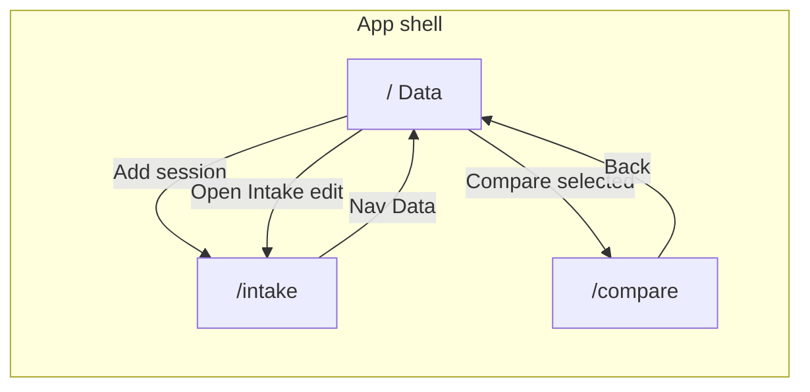

# Client page flows

Routes, screens, and backend touchpoints. **Update this file** when routes or API usage change.

---

## Planned routes (WO-ui-shell)

| Route | Screen | Purpose |
|-------|--------|---------|
| `/` | Data | Session list, lap list, comparison selection |
| `/intake` | Intake | Register/edit session, markers, player |
| `/compare` | Comparison | Synced multi-lap playback |

Nav: global header links among the three (see `UI_DESIGN.md`).

---

## Flow diagram (target)

---

## API touchpoints (by screen)

Status: **mock in UI shell**; real endpoints come from `api` work orders.

| Screen | Endpoint (planned) | Method | Notes |
|--------|-------------------|--------|-------|
| Data | `/api/sessions` | GET | List sessions |
| Data | `/api/sessions/:id/laps` | GET | Laps for selection |
| Intake | `/api/sessions` | POST | Register session |
| Intake | `/api/sessions/:id` | PATCH | Metadata auto-save |
| Intake | `/api/sessions/:id/markers` | PUT/PATCH | Marker auto-save |
| Intake | `/api/video/:id/stream` | GET | Range video stream |
| Compare | `/api/compare` or per-lap stream URLs | GET | TBD in API WO |

**Current spike only:** `GET /api/video/demo` (hardcoded demo clip).

---

## Work order links

- [WO-ui-shell](../../work-orders/WO-ui-shell.md) — static layouts, no real API yet
